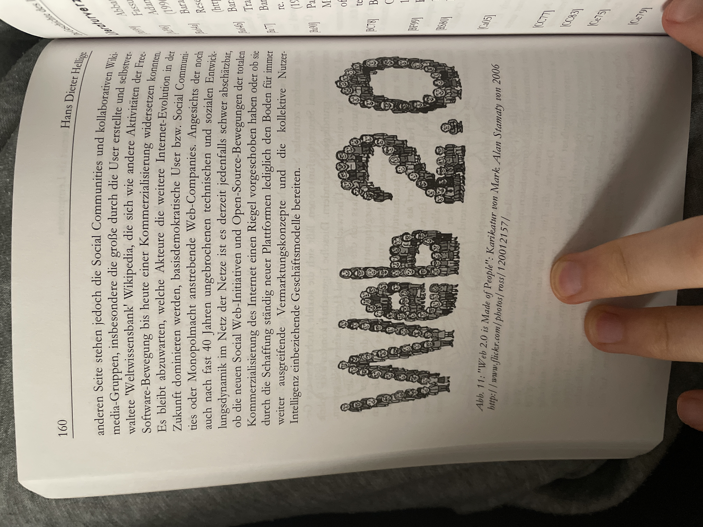

# Klimawoche

## Verworfen: Firmen und Nachhaltigkeit
Magnificent Seven (US): Apple, Microsoft, Nvidia, Tesla, Alphabet, Amazon, Meta ersetzten Big Oil
https://arc.net/l/quote/zmftgmbm

### Vergleich von Mission Statements: SAP
https://news.sap.com/2024/02/sap-journey-to-net-zero-2030/

https://www.sap.com/products/sustainability/our-approach.html

Bezugnahme auf:
https://sciencebasedtargets.org/news/sbti-launches-world-first-net-zero-corporate-standard

https://netzeroclimate.org/what-is-net-zero-2/#:~:text=Net%20zero%20refers%20to%20a,the%20need%20for%20net%20zero

## Zentralität vs. Dezentralität unter Nachhaltigkeits und Demokratieaspekten
Synergie Effekte („waste energy“) nutzen

## Geschichte des Internets - Internetgenese

## Argumentationslinien
### Why should I (als Informatiklai:in) care?
- **neuere Internetgeneseforschung:** Das heutige Internet ist nicht primär das Produkt einiger weniger Genies, sondern entstand durch und wurde durch die Bedürfnisse der Nutzer:innen maßgeblich mitgestaltet. Die meisten Pioniere des Internets hatten eine recht eingeschränkte Vision darüber, was ihre Entwicklungen bezwecken sollten. (Meist kleine sehr klar abgegrenzte use cases → „Leitbildfixierung“ Hellige 141). Immer wieder Aneignungsprozesse die durch die Entwicklungsoffenheit gewährleistet werden konnte
  - US-Militär als „machtvolle Normungsinstanz“ (Hellige 155) schloss die “organisatorische Lücke“ (Kubicek zit. nach Hellige 155)
  - „Die Forderung nach dem Zugriff auf alle öffentlichen Netze im Kriegs- und Spannungsfall machte die Internetwelt zu einer wirklich offenen Netz[welt????] auch im zivilen Bereich - mit einer unter Privacy-Aspekten allerdings nicht unproblematischen Transparenz des Netzgeschehens.“ (Hellige 154)
  - „Das Interent erweist sich so aus der Rückschau als der Glücksfall einer großtechnischen Systementwicklung, die so niemand vorab geplant hat, die in der Architektur aber so flexibel war, dass sie an immer größere Nutzerpopulationen und immer neue Anwendungsgebiete angepasst werden konnte. Die Entwicklungsoffenheit beruhte jedoch nur zum Teil auf militärischen Vorgaben, sie war vielmehr wesentlich das Resultat der disparaten Akteurskonstellation und einer Koexistenz unterschiedlicher Leitbilder“ (Hellige 154)
  - „Die zivilen Akteure waren aufgrund der eigenen Unternehmensinteressen für einen so umfangreichen Normungsprozess nicht fähig oder bereit. Denn diese benutzten wie IBM und die proprietären Anbieter die Architekturen als Fangnetze für die Kunden […]“ (Hellige 155)
  - **nochmal Seiten 142, 153 ergänzend lesen**

### Internet-Historie in a Nutshell: Proprietäre Silos vs. offene Normung
- US-Militär fordert dezentralen Datenaustausch (insbesondere der Atomwaffenlager unterienander, ein Netz, welches nicht an einem zentralen Punkt angegriffen werden könnte, um komplett zum Erliegen zu kommen) → Normungsinstanz für netzwerkagnostischen Datenaustausch → TCP/IP für das ARPAnet
- parallel exisiterten im wirtschaftlichen Sektor schon viele unterschiedliche proprietäre Kommunikationsstandrards (→ Silos um die Nutzer:innen bei einem Anbieter zu halten)
- da das ARPAnet zunächst sehr limitierte Anwendungszwecke hatte, entfalteten sich weitere durch Arpanet ausgeschlossene Netzkulturen: BITNET, Fidonet, Usenet etc.
- in europäischen Wissenschaftskreisen entwickelte und verbeitete sich das weitaus umfangreichere OSI-Modell, wodurch man die Weiterentwicklung des ARPAnets in Gefahr sah.
- dadurch mitte der 80er: Cerf und Kahn: Werben für TCP/IP Protokollfamilie in akademischen Kreisen → über die Einbindung vor allem der UNIX-Culture und dem NSFNet dann Erreichen einer so großen „kritischen Masse“, dass es sich bald in allen Sektoren etablierte und das OSI-Modell verdrängte (letzten 4: Hellige 157) → Schließen der Anwendungslücke
- **Damit Erschließung durch die Wirtschaft: Zunächst nutzung der offenen Protokolle anstatt proprietären → so konnten viel mehr Kund:innen erreicht werden, allerdings:**
- „Seit den 90iger Jahren versuchen mächtige Software-Hersteller, Internet-Provider […] über Verknüpfungen der Internet- und WWW-Protokolle mit proprietären Betriebssystemen, mit Browser-, Suchmaschinen- oder Nutzerplattform-Software Marktmacht oder gar eine Vormachtstellung im Internet zu erlangen. Zugleich bemühen sich Content- und Software-Anbieter, die bisherige Offenheit des Internets wieder einzuschränken, indem sie durch z.T. rigide Digital Right Management-Instrumente den freien Zugang reglementieren und den ursprünglichen Open-Source-Charakter des Internets zugunsten rein kommerziellen Informationsangeboten […] zurückdrängen wollen“ (Hellige 159)
- mittlerweile auch Internetstruktur siloartig: z.B. besitzt Google eigene Glasfaserunterseekabel allein für ihre eigenen Clouddienste, ohne am öffentlichen transkontinentalen Datenaustausch zu partizipieren (hier nochmal Quelle; Pressemitteilung Google Cloud)
- **seitdem: dutzende proprietäre und offene Schnittstellen und Protokolle in der Entwicklung**
- Auswahl an modernen und offenen Standards: ActivityPub, Matrix, Blockchain (@David), Torrenting

**Warum proprietäre Dienste schlecht für die Nachhaltigkeit sind**
1. **Intransparenz und Unspezifizität von Closed Source (ohne unabhängige Audits)**
2. closed source lässt sich nicht einfach auf Nachhaltigkeitskriterien überprüfen (theoretisch berechnungszeit und datenverkehr einschätzbar von außen aber einsparpotenziale nicht direkt ersichtlich)
3. proprietäre Standardsoftware (Middleware, APIs, etc.) meist für breites Anwendungsspektrum konzipiert (möglichst viele Abnehmer), welches tendenziell mehr (unnötige) Daten(verkehr) generiert und berechnungsaufwand benötigt
4. **→ Nachhaltiges Programmieren**
   - **hier vermutlich Verknüpfungspunkt zu Riko**
5. verallgemeinerte/universal Schnittstellen bürgen auch die Gefahr unnötigen Datenverkehrs, da nicht anwendungsspezifisch genug → lightweight wie TCP/IP welches sich gerade deswegen ggü OSI durchgesetzt hat**

- Der E-Mail-Dienst Posteo ist einer der wenigen Internetanbieter, der für seine Server nur Ökostrom nutzt und versucht, die Anzahl der Server möglichst gering zu halten – durch nachhaltiges Programmieren. Mitgründer Patrik Löhr erklärt: „Also definitiv ist die Hardware der größere Faktor, aber wenn wir Sachen für unseren Dienst programmieren, ist es schon so, dass wir beeinflussen können, wie machen wir durch unsere Programmierung, die Sachen effizient, so dass viele Kunden mit der gleichen Software in kürzerer Zeit von einem Server bedient werden können.“ Bei Posteo gibt es zum Beispiel keinen Spam-Ordner. Die unerwünschten Mails werden direkt abgelehnt, so dass sie nicht auf den Servern verarbeitet und gespeichert werden müssen. Um nachhaltige Software zu nutzen, programmiert Posteo außerdem viel selbst. Denn Standardsoftware sei meistens für so viele mögliche Anwendungsfälle konzipiert, dass sie überfrachtet und damit energieintensiver sei, meint Patrick Löhr. Auch Datenschutz habe viel mit Nachhaltigkeit zu tun. „Alles was wir nicht loggen, die ganzen Sachen, um Profile von Nutzern zusammenzuführen, das braucht alles Speicher und Platz und den brauchen wir nicht. Tatsächlich ist es für Entwickler bei uns, wenn sie neu sind, sehr ungewöhnlich darauf zu achten, dass sie immer nur das speichern, was wir wollen, dass gespeichert wird. Das ist tatsächlich auch nicht ganz einfach manchmal, weil solche Entwicklungsframeworks, die es viel gibt, die legen einfach zig Datenbankfelder von sich aus an und befüllen die standardmäßig mit Daten, von denen irgendjemand mal gedacht hat, dass man die wahrscheinlich brauchen wird zur Analyse von was weiß ich.“https://arc.net/l/quote/mjjnrnpn (Deutschlandfunk)

**Kostenlos == nicht nachhaltig?**
- Profilbildung: Je mehr Daten ein Unternehmen hat, desto mehr Berechnungen können auch angestellt werden, desto mehr Speicherhardware bracht man (siehe auch DLF oben) → vorsicht vor ecosystem effect (siehe Video)

- **hier könnte man anbringen, dass laut DSGVO Onlinedienste nun alle gespeicherten Daten herausgeben müssen. Anregung zum Selbstexperiment: Welche Daten wurden durch meine Nutzung produziert? → Damit aber nicht die Schuld aufs Individuum lenken, sondern eher zeigen, wie unnötig teilweise dieses Datensammeln ist. Bewussten Umgang anregen**
  - gute Beispiele: Google Takeout und Spotify: also z.B. Warum bewahrt Spotify die ganze Streaminghistorie millisekundengenau auch über Jahre hinweg auf? Reicht nicht z.B. nur ein Jahr.­

**Wenn aus einem Ökosystem ein Walled Garden wird**

https://youtube.com/watch?=UdzT1YxeZsY 
Dazu auch aus wirtschaftswissenschaftlicher, kapitalismuskritischen Sicht: Technofeudalism: Es entstehen Inseln feudaler Logik (Internetdienstanbieter als Steuerinstanz und Mieten/Rentennehmer zwischen Händler (Vasallen) und Kunden (Leibeigene)) → hierzu noch ausführlicher

**Interoperatibilität- und User-Choice (mit Blick auf die EU)**
- DMA/DSA: „Gatekeeper“ Dienste müssen interoperabel werden (z.B. WhatsApp Schnittstelle zu anderen Messengern; Schnittstelle muss aber nicht einem bestimmten festgelegten Standard entsprechen)**
**

**
**
**
**
**Lokale Verarbeitung statt in der Cloud**
- Moderne Geräte sind heutzutage für viele Aufgaben mehr als leistungsstark genug um nicht auf die Cloud zurückgreifen zu müssen.
  - z.B. können Dateien gut auch lokal konvertiert werden, trotzdem gibt es tausende Konverterwebdienste, die dann auch volle Einsicht in die Dokumente erlangen
    - meisten gängigen Dokument-Formate können von Standardsoftware konvertiert werden; Mediadateien von Programmen die ffmpeg nutzen (https://github.com/topics/ffmpeg-gui)
  - Stichwort KI: mittlerweile gibt es auch für viele Aufgaben ausreichend starke bzw. darauf spezialisierte LMs, die lokal laufen können (https://github.com/nomic-ai/gpt4all, https://github.com/janhq/jan )
- **Dezentralisierte/Hybride Verarbeitung (gibt es dafür evtl. einen Fachbegriff): Soviel wie möglich lokal bearbeiten und dynamisch Rechnerleistung aus der Cloud beanspruchen, wenn lokale Rechenleistung nicht ausreicht.**

**mögliche Diskussionsfragen**
- Inwiefern und wie können und sollten Organisations- und Normungsinstanzen demokratisch legitimiert sein?  Wie zentral darf es sein?
- Wie kann eine gute Balance zwischen Normung und technologischer Innovation geschaffen werden? Welche Rolle könnte dabei die Wissenschaft spielen?**

**Daraus ergeben sich evtl. zentrale Forderungen:**
- demokratisch legitimierte (nachhaltigkeits) Audits
- Interoperabilitätndurch offene (demokratisch oder akademisch) genormte Schnittstellen
- dezentral organisierte Dienste ohne Silos → user choice und trust des Serviceanbieters (z.B. freie AUswahl des Mastodon Servers oder sogar self-hosting) ←→ mehr Datenverkehr im Server-Server Austausch (?)
- soviel lokale/offline Datenverarbeitung wie möglich, z.B. lokale LMs benutzen
